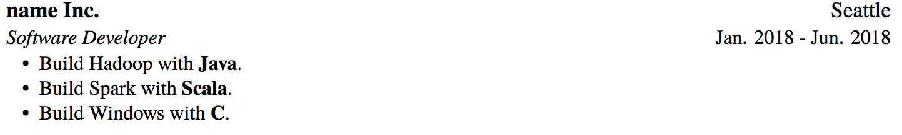
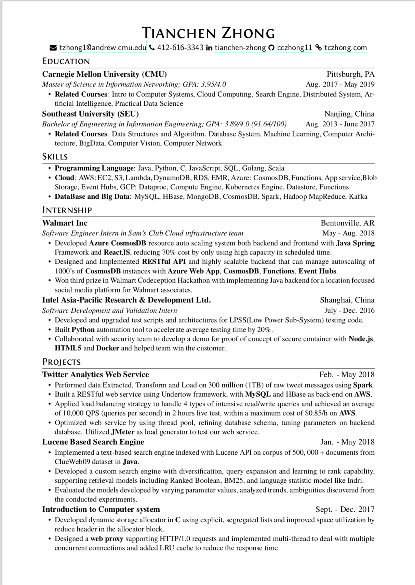

# Resume Build script

This project is based on project [resume](https://github.com/billryan/resume/tree/master). In order to build mulitple resume for different company. I build this project.

In this project, I defined all components in resume as a **JSON** object and it is easily to modify and manage.

## Install

Make sure you have the following software:

- texlive
- Python3.6+

## Run

**Before running, make sure change your user information in `init.tex`**. 

Use the following command to run the code.

```bash
python BuildResume.py {resume}.json
```

After running, you could find your resume pdf file and tex file in the root dir.

## JSON

There are several types **JSON** file in my project.

### Main resume

The template is defined as the following code:

```json
{
    "filename":"filename.tex",
    "education":"all(search item with this id)",
    "skillset":"all(search item with this id)",
    "experience":"all(search item with this id)",
    "project":["xx","xxx","xxx","(search item with this name)"]
}
```

The you could use this file to generate your resume.

### Project/FullTime/Intern/Education

The template is defined as the following code:

```json
{
    "id": "normal",
    "name": "",
    "date": "",
    "place": "",
    "title": "",
    "tech": [""],
    "bullet": ["", "", ""]
}
```

You could define them based on your profile and display your experience or projects in this way. In propertity `tech`, you could define all words you want to highlight in your bullect points.



You should have the following json file in your ProjectJson folder.

- Education.json
- Experience.json
- Project.json
- SkillSet.json

### Skills

The template is defined as the following code. `id` is to identify the skill, other line equal to one line of skill.

```json
{
    "id":"cloud",
    "Programming Language":["Java","Python","C"],
    "Cloud":["AWS: EC2, S3, Lambda"],
    "DataBase and Big Data":["MySQL","Hadoop MapReduce","Kafka"]
}
```

# demo pdf

